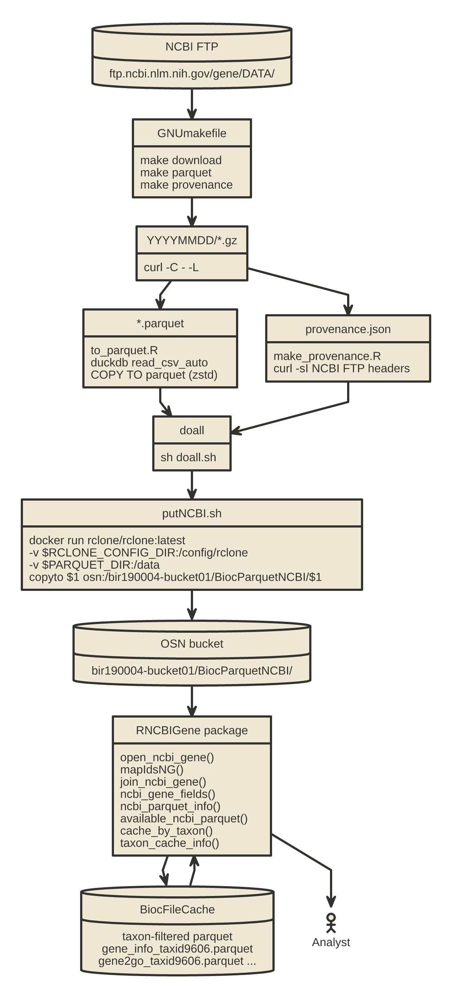

# RNCBIGene

Performant and standard representations of gene annotation for all organisms cataloged by NCBI

# Installation

`BiocManager::install("vjcitn/RNCBIGene")`


# Purposes

## Simplified, unified annotation for all organisms addressed by NCBI

The `org.*.*.db` packages are powerful and reliable but have
a complex stack of schemata and scripts for generating organism-specific
packages.

This package works on the basis of very simple transformations to parquet format of compressed
text from NCBI.  The parquet files are placed in an NSF Open Storage Network bucket.  This package
includes scripting that carries out the entire workflow of retrieval from NCBI,
transformation to parquet, movement to cloud storage, and recording of provenance.

Code is available to transfer resources to local cache, but the primary
use cases are expected to be solved using DuckDb over HTTPS.

```
> remote_gene_query(gres="gene_info", qual='where "#tax_id" = 9606 limit 10')
# A query:  ?? x 16  
# Database: DuckDB 1.5.4 [vincentcarey@Darwin 24.6.0:R 4.6.1/:memory:]
   `#tax_id` GeneID Symbol LocusTag Synonyms     dbXrefs chromosome map_location
       <dbl>  <dbl> <chr>  <chr>    <chr>        <chr>   <chr>      <chr>       
 1      9606   4038 LRP4   -        CLSS|CMS17|… MIM:60… 11         11p11.2     
 2      9606   4040 LRP6   -        ADCAD2|EVR8… MIM:60… 12         12p13.2     
 3      9606   4041 LRP5   -        BMND1|EVR1|… MIM:60… 11         11q13.2     
 4      9606   4043 LRPAP1 -        A2MRAP|A2RA… MIM:10… 4          4p16.3      
 5      9606   4045 LSAMP  -        IGLON3|LAMP  MIM:60… 3          3q13.31     
 6      9606   4046 LSP1   -        WP34|pp52    MIM:15… 11         11p15.5     
 7      9606   4047 LSS    -        APMR4|CTRCT… MIM:60… 21         21q22.3     
 8      9606   4048 LTA4H  -        -            MIM:15… 12         12q23.1     
 9      9606   4049 LTA    -        LT|TNFB|TNF… MIM:15… 6          6p21.33     
10      9606   4050 LTB    -        TNFC|TNFSF3… MIM:60… 6          6p21.33     
# ℹ 8 more variables: description <chr>, type_of_gene <chr>,
#   Symbol_from_nomenclature_authority <chr>,
#   Full_name_from_nomenclature_authority <chr>, Nomenclature_status <chr>,
#   Other_designations <chr>, Modification_date <dbl>, Feature_type <chr>
```

## Annotation in a tidyverse style

By retaining the "flat file" model of the original all-organism
annotation content at NCBI, we may more straightforwardly
have access to annotation mappings in tidyverse-style programming.

```
> c1 = open_ncbi_gene("gene2go", taxid=10090)
> c2 = open_ncbi_gene("gene_info", taxid=10090)
> c2 |> filter(Symbol == "Lilrb4a") |> left_join(c1, by="GeneID") |> 
+    select(Category, GO_term) |> distinct()
# A query:  ?? x 2   
# Database: DuckDB 1.5.4 [vincentcarey@Darwin 24.6.0:R 4.6.1/:memory:]
   Category  GO_term                                      
   <chr>     <chr>                                        
 1 Function  integrin binding                             
 2 Function  protein phosphatase binding                  
 3 Process   response to wounding                         
 4 Component cell surface                                 
 5 Function  immune receptor activity                     
 6 Component external side of plasma membrane             
 7 Component plasma membrane                              
 8 Process   cellular response to lipopolysaccharide      
 9 Process   negative regulation of monocyte activation   
10 Process   CD8-positive, alpha-beta T cell proliferation
```

# Basic metadata

```
> ncbi_parquet_info()
                              resource size_bytes          bucket_modified
1                    gene_info.parquet  951206411 2026-07-22T19:01:51.231Z
2               gene_orthologs.parquet   62310042 2026-07-22T19:01:54.029Z
3 gene_refseq_uniprotkb_collab.parquet  510820503 2026-07-22T19:02:15.685Z
4               gene2accession.parquet 3111866681 2026-07-22T19:00:09.796Z
5                 gene2ensembl.parquet  201322528 2026-07-22T19:00:14.050Z
6                      gene2go.parquet  550607120 2026-07-22T19:00:31.108Z
7                  gene2pubmed.parquet  115550070 2026-07-22T19:00:33.657Z
8                  gene2refseq.parquet 1460763355 2026-07-22T19:01:18.313Z
             ncbi_last_modified
1 Wed, 22 Jul 2026 06:12:27 GMT
2 Wed, 22 Jul 2026 06:14:51 GMT
3 Tue, 21 Jul 2026 09:12:44 GMT
4 Wed, 22 Jul 2026 06:04:29 GMT
5 Wed, 22 Jul 2026 06:04:48 GMT
6 Wed, 22 Jul 2026 06:06:46 GMT
7 Wed, 22 Jul 2026 06:07:08 GMT
8 Wed, 22 Jul 2026 06:10:14 GMT
```

# Local caching and reproducibility

## Caching for offline or high-performance use

`cache_by_taxon()` performs a one-time filter of each remote parquet to a
single taxon and stores the result locally in `BiocFileCache`.  After that,
`open_ncbi_gene()` — and every function that calls it — routes to the local
file with no change to the API.

```r
cache_by_taxon(9606L)              # human: all eight resources (one-time, slow)
cache_by_taxon(10090L)             # mouse

taxon_cache_info(9606L)            # list cached entries for human
clear_taxon_cache(9606L)           # remove live cache, route back to OSN
```

## Freezing a snapshot for reproducibility

`freeze_taxon_cache()` makes a physical copy of the current live cache under
an identifying tag.  Frozen entries survive `clear_taxon_cache()` and can
only be removed explicitly.  Duplicate tags are rejected unless `force=TRUE`.

```r
freeze_taxon_cache(9606L, tag = "paper_2026_07")   # snapshot current human cache

# query the frozen version via freeze_tag=
open_ncbi_gene("gene_info", taxid = 9606L, freeze_tag = "paper_2026_07") |>
  dplyr::filter(Symbol == "TP53") |>
  dplyr::select(Symbol, GeneID, map_location) |>
  dplyr::collect()
```

`open_ncbi_gene()` stops with a clear message if the requested tag is not
found, making broken reproducibility pipelines fail loudly rather than
silently falling back to a different data version.

# Construction of the package and web resources

See `inst/preps`.


